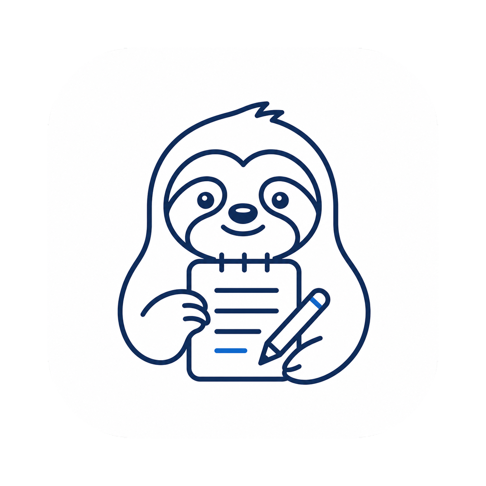

<p align="center">
  
</p>

<h1 align="center">MENO</h1>

<p align="center">
  대면 회의를 자동으로 회의록화하는 macOS 데스크톱 앱<br>
  <b>녹음 → 한국어 전사 → 회의록 작성 → Notion 업로드</b>, 전부 당신의 맥 안에서.
</p>

---

음성 처리·전사·요약 전 과정이 **로컬에서** 돌고, 외부로 나가는 데이터는 사용자가 직접 켠 경우의 Notion 업로드뿐입니다. 모든 회의록에 대해 자연어로 질문할 수 있는 **로컬 LLM 채팅**이 내장돼 있습니다.

## 주요 기능

- **로컬 STT** — Whisper Large-v3 Turbo로 한국어 정밀 전사 (Metal GPU 가속)
- **회의록 자동 작성** — Qwen 2.5-7B로 TL;DR·안건·논의·결정·액션 표준 포맷. 1시간+ 회의는 자동 청크 처리
- **오디오 플레이어** — 회의 상세에서 녹음 재생/탐색/배속(1× 1.5× 2×)/10초 뒤로
- **회의록 챗봇** — 전체 또는 선택한 회의록 범위로 자연어 질문, 마크다운 응답
- **Notion 자동 업로드** + **회의록 내보내기** (`.md` / `.docx`)
- **녹음 일시정지/재개**, 라우트 이동해도 살아있는 백그라운드 세션
- 라이트/다크 테마, macOS 네이티브 vibrancy 사이드바

---

## 설치 (바로 받아서 쓰기)

> macOS 12(Monterey) 이상. Apple Silicon · Intel 모두 지원. 첫 실행 시 모델 다운로드용 디스크 여유 **약 8GB**가 필요합니다.

### 1. DMG 다운로드

[**최신 릴리스에서 다운로드 →**](https://github.com/stronghuni/MENO/releases/latest)

| 맥 종류 | 파일 |
|---|---|
| Apple Silicon (M1~M4) | `meno-<버전>-arm64.dmg` |
| Intel | `meno-<버전>-x64.dmg` |

> 내 맥이 어느 쪽인지 모르면: 좌상단  → "이 Mac에 관하여" → 칩이 `Apple M…`이면 Apple Silicon.

### 2. 설치

DMG를 더블클릭해 열고, **MENO**를 **Applications** 폴더로 드래그합니다.

### 3. 첫 실행 — Gatekeeper 한 번만 풀기

MENO는 Apple Developer 인증서로 공증(notarize)되지 않은 빌드라, 처음 열 때 macOS가 *"손상되었기 때문에 열 수 없습니다"* 또는 *"확인되지 않은 개발자"*로 막습니다. **터미널에서 아래 한 줄**을 실행해 격리 속성을 제거하면 이후로는 정상 실행됩니다:

```bash
xattr -dr com.apple.quarantine /Applications/MENO.app
```

그런 다음 Launchpad나 Applications에서 MENO를 엽니다.

> 이 명령은 다운로드한 파일에 macOS가 자동으로 붙이는 "격리(quarantine)" 표시만 지웁니다. 앱 자체를 수정하지 않습니다. 정식 공증 빌드를 받으면 이 단계는 필요 없습니다.

### 4. 마이크 권한

첫 녹음 시 마이크 접근 권한을 묻습니다 → **허용**. (거부했다면 시스템 설정 → 개인정보 보호 및 보안 → 마이크에서 MENO 켜기)

### 5. 모델 다운로드 (첫 실행, 1회)

앱이 처음 뜨면 온보딩 화면이 모델 2개를 자동 다운로드합니다 (총 약 **6.3GB**, 진행률 표시, 끊겨도 이어받기):

| 모델 | 용량 | 용도 |
|---|---|---|
| Whisper Large-v3 Turbo (GGML) | 1.6GB | 한국어 전사 |
| Qwen 2.5-7B-Instruct Q4_K_M (GGUF) | 4.7GB | 회의록 작성 + 채팅 |

다운로드가 끝나면 바로 녹음할 수 있습니다. 별도 API 키·로그인 불필요.

---

## 사용법

### 새 회의 녹음
1. 사이드바 **새 회의** → 제목·날짜·참여자 입력 → 마이크 선택 → **녹음 시작**
2. 녹음 중 마이크 레벨에 반응하는 도트 파형. **일시정지 / 재개 / 회의 종료** 버튼
3. 종료하면 자동으로: **전사 → 회의록 작성 → (켜둔 경우) Notion 업로드**

### 회의 상세
- 상단 **오디오 플레이어** (재생·타임라인·배속·10초 뒤로)
- 좌측 **전사본** / 우측 **회의록**(마크다운, "편집"으로 수정)
- **Notion에 업로드** 버튼, ⋯ 메뉴 (오디오 다운로드 · 회의록 내보내기 `.md`/`.docx` · 삭제)

### 채팅 — 회의록 어시스턴트
- 사이드바 **채팅**. 입력창 **+ 버튼**으로 특정 회의 선택 시 그 범위만, 미선택 시 전체 회의록 대상
- 회의와 무관한 질문은 *"회의록과 관련된 질문에만 답해드릴 수 있습니다."* 로 거절. 대화는 영속 저장

### 라이브러리
- 카드 그리드, 상태 배지(회의록/Notion). 호버 체크박스로 **다중 선택 + 일괄 삭제**

---

## Notion 연동 (선택)

회의록을 자동으로 Notion에 올리려면:

1. **Integration 생성** — [notion.so/my-integrations](https://www.notion.so/my-integrations) → New integration → Internal → 토큰 복사 (`secret_…` / `ntn_…`)
2. **부모 페이지 권한** — 회의록을 모아둘 Notion 페이지 열기 → `⋯ → Connections → 방금 만든 Integration` 선택
3. **앱 설정** — MENO 설정 → 토큰 붙여넣기 → **Keychain에 저장** → 드롭다운에서 부모 페이지 선택 → 자동 업로드 ON

토큰은 macOS Keychain에 저장됩니다 (앱 파일에 평문 저장 안 함). 통합에 페이지 권한을 안 주면 드롭다운이 비어 있으니 2단계를 다시 확인하세요.

---

## 데이터 위치

모든 데이터는 로컬에만 저장됩니다.

| 자료 | 경로 |
|---|---|
| SQLite DB | `~/Library/Application Support/meno/meno.db` |
| 원본 오디오 (WAV) | `~/Library/Application Support/meno/recordings/<id>.wav` |
| 모델 | `~/Library/Application Support/meno/models/` |
| 채팅 history | `~/Library/Application Support/meno/chat.json` |
| 앱 설정 | `~/Library/Application Support/meno/settings.json` |
| Notion 토큰 | macOS Keychain (`io.namuneulbo.meno / notion.token`) |

앱을 완전히 지우려면 위 `meno/` 폴더 + Keychain 항목을 삭제하면 됩니다.

---

## 소스에서 빌드 (개발자)

### 사전 준비

| 요구사항 | 버전 |
|---|---|
| macOS | 12 이상 (Apple Silicon 권장) |
| Node.js | **20.x 또는 22.x LTS** (홀수 메이저는 `better-sqlite3` ABI 충돌 잦음) |
| Xcode CLT | `xcode-select --install` (네이티브 모듈 빌드용) |

### 실행

```bash
git clone https://github.com/stronghuni/MENO.git
cd MENO
npm install              # 네이티브 모듈을 Electron ABI에 맞춰 자동 재빌드 (postinstall)
npm run dev              # Electron + Vite HMR + dev HTTP 브리지(:9877)
```

ABI 에러로 설치가 실패하면:
```bash
npm install --ignore-scripts
npx @electron/rebuild -f -w better-sqlite3 -w smart-whisper -w keytar
```

### 자주 쓰는 스크립트

```bash
npm run typecheck    # tsconfig.node + tsconfig.web
npm test             # vitest 단위 테스트
npm run build:mac    # macOS DMG (arm64 + x64) + zip 생성 → dist/
```

### 직접 빌드한 DMG로 배포할 때

`electron-builder.yml`에 Apple Developer 인증서가 없으면 ad-hoc 서명으로 빌드됩니다. 받는 사람은 위 [설치 3단계](#3-첫-실행--gatekeeper-한-번만-풀기)의 `xattr` 명령으로 격리를 풀어야 합니다. 정식 배포하려면 인증서 + 공증이 필요합니다:

```yaml
mac:
  notarize: true
  identity: "Developer ID Application: Your Name (TEAM_ID)"
```

---

## 아키텍처

```
src/
├─ main/                  Node 메인 프로세스
│  ├─ index.ts            부트스트랩 / 윈도우 / meno-audio:// 프로토콜 / 종료 핸들러
│  ├─ handlers.ts         IPC 채널 → 핸들러 매핑 (Electron + dev 브리지 공용)
│  ├─ devBridge.ts        개발용 HTTP+SSE 브리지(:9877)
│  ├─ services/           storage·recording·transcriber·summarizer·chat·processor·notion·keychain·downloader·docxExport
│  └─ domain/prompts.ts   표준 회의록 프롬프트 + 청크 분할
├─ preload/index.ts       contextBridge로 window.api 노출
├─ shared/                IPC 타입 + modelSpecs
└─ renderer/src/          React 19 + HashRouter (NewMeeting / MeetingDetail / Library / Chat / Settings)
```

화자 분리는 제거됨 (onnxruntime 1.24 KleidiAI Conv가 Apple Silicon에서 SIGTRAP). 디자인 시스템은 [DESIGN.md](DESIGN.md) 참조.

---

## 알려진 제약

- 1시간 회의 처리 시 메모리 피크 ≈ 8GB (Whisper + Qwen 동시 로드 구간)
- 미공증 빌드는 첫 실행에 `xattr` 격리 해제 필요 (위 설치 안내)
- Notion 페이지 children은 한 번에 100개 제한 → 긴 회의록은 자동 batch 분할

---

## 라이선스

사용된 모델 라이선스는 각 페이지 참조:
- [openai/whisper](https://github.com/openai/whisper) (MIT)
- [Qwen/Qwen2.5-7B-Instruct](https://huggingface.co/Qwen/Qwen2.5-7B-Instruct) (Apache 2.0)
